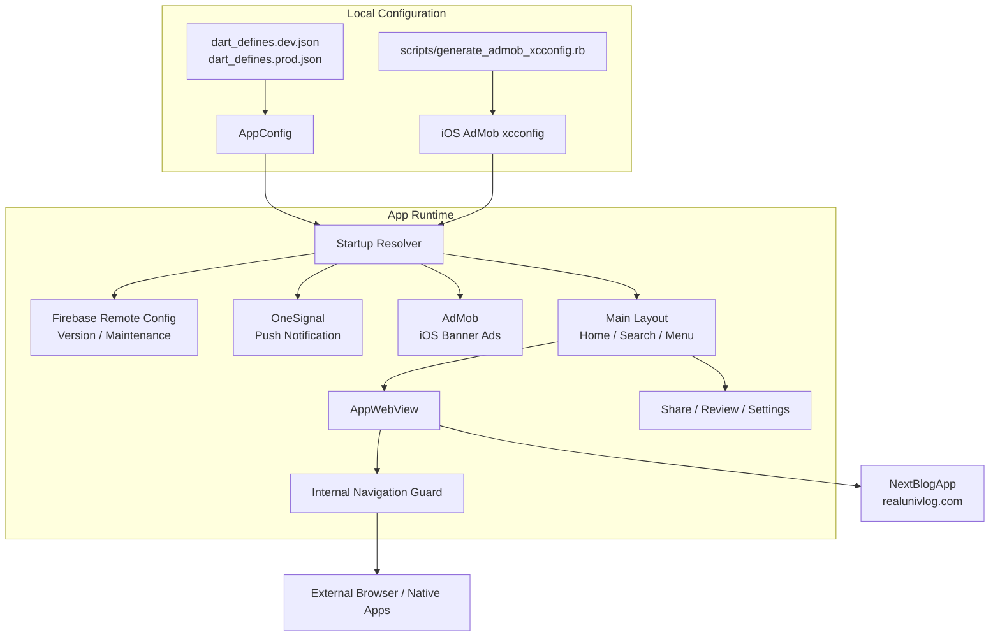

<div id="top"></div>

<div align="right">


</div>


## 目次

- [リアル大学生：モバイル](#top)
  - [目次](#目次)
  - [リンク一覧](#リンク一覧)
  - [使用技術](#使用技術)
  - [アーキテクチャ](#アーキテクチャ)
  - [環境構築](#環境構築)
  - [テスト](#テスト)
  - [ディレクトリ構成](#ディレクトリ構成)
  - [Gitの運用](#Gitの運用)
    - [ブランチ](#ブランチ)
    - [コミットメッセージの記法](#コミットメッセージの記法)

## リンク一覧

<ul>
  <li><a href="/.docs/store/images/AppStore.png">App Store（スクリーンショット）</a></li>
  <li><a href="/.docs/store/images/GooglePlay.png">Google Play（スクリーンショット）</a></li>
  <li><a href="https://www.figma.com/design/8abXv3H0UaRwCjkyy8lecU/%E3%82%B9%E3%82%AF%E3%83%AA%E3%83%BC%E3%83%B3%E3%82%B7%E3%83%A7%E3%83%83%E3%83%88?node-id=0-1&t=RxhblDmbNSeXsEgf-1">Figma</a></li>
</ul>

<p align="right">(<a href="#top">トップへ</a>)</p>

## 使用技術

| Category     | Technology Stack                              |
| ------------ | --------------------------------------------- |
| App          | Flutter, Dart                                 |
| Platform     | iOS, Android                                  |
| Backend      | Firebase Remote Config                        |
| Google       | AdMob, Analytics                              |
| Integrations | WebView, OneSignal, Share Plus, In-App Review |
| Design       | Figma, Canva                                  |
| Development  | Xcode, Android Studio, CocoaPods              |

<p align="right">(<a href="#top">トップへ</a>)</p>

## アーキテクチャ



<p align="right">(<a href="#top">トップへ</a>)</p>

## 環境構築

```
# リポジトリのクローン
git clone git@github.com:Arata1202/FlutterBlogApp.git
cd FlutterBlogApp

# Firebaseから必要なファイルを入手
cp GoogleService-Info.plist ios/Runner/
cp google-services.json android/app/

# 依存関係のインストール
flutter pub get

# CocoaPodsのインストール
cd ios && pod install && cd ..

# dart-define用のローカルファイルを作成
cp dart_defines.dev.example.json dart_defines.dev.json
cp dart_defines.prod.example.json dart_defines.prod.json

# dart_defines.*.jsonの編集
vi dart_defines.dev.json
vi dart_defines.prod.json

# iOS用のAdMob xcconfigを生成
ruby scripts/generate_admob_xcconfig.rb --environment dev

# アプリの起動
flutter run --dart-define-from-file=dart_defines.dev.json
```

```
# iOSリリースビルド
ruby scripts/generate_admob_xcconfig.rb --environment prod
flutter build ios --release --dart-define-from-file=dart_defines.prod.json

# Androidリリースビルド（android/key.propertiesが必要）
flutter build appbundle --release --dart-define-from-file=dart_defines.prod.json

# Xcodeから起動
open ios/Runner.xcworkspace
```

<p align="right">(<a href="#top">トップへ</a>)</p>

## テスト

```
# 静的解析
flutter analyze

# ユニットテスト
flutter test

# Dartフォーマット確認
dart format --set-exit-if-changed .
```

<p align="right">(<a href="#top">トップへ</a>)</p>

## ディレクトリ構成

```
❯ tree -a -I ".dart_tool|build|.git|.DS_Store|*.iml|Pods|Flutter|ephemeral|Generated.xcconfig|GeneratedPluginRegistrant.*|firebase_app_id_file.json|GoogleService-Info.plist|google-services.json|xcuserdata|DerivedData|.flutter-plugins|.flutter-plugins-dependencies|dart_defines.dev.json|dart_defines.prod.json|Podfile.lock|.symlinks|linux|macos|windows|local.properties|pagination" -L 3
.
├── .docs
│   ├── readme
│   │   └── images
│   └── store
│       └── images
├── .gitignore
├── .metadata
├── LICENSE
├── README.md
├── analysis_options.yaml
├── android
│   ├── .gitignore
│   ├── app
│   │   ├── build.gradle
│   │   └── src
│   ├── build.gradle
│   ├── gradle
│   │   └── wrapper
│   ├── gradle.properties
│   └── settings.gradle
├── assets
│   ├── 2.png
│   ├── icon-512x512.png
│   └── title.webp
├── dart_defines.dev.example.json
├── dart_defines.prod.example.json
├── ios
│   ├── .gitignore
│   ├── OneSignalNotificationServiceExtension
│   │   ├── Info.plist
│   │   ├── NotificationService.h
│   │   ├── NotificationService.m
│   │   └── OneSignalNotificationServiceExtension.entitlements
│   ├── Podfile
│   ├── Runner
│   │   ├── AppDelegate.swift
│   │   ├── Assets.xcassets
│   │   ├── Base.lproj
│   │   ├── Info.plist
│   │   ├── Runner-Bridging-Header.h
│   │   ├── Runner.entitlements
│   │   └── ja.lproj
│   ├── Runner.xcodeproj
│   │   ├── project.pbxproj
│   │   ├── project.xcworkspace
│   │   └── xcshareddata
│   ├── Runner.xcworkspace
│   │   ├── contents.xcworkspacedata
│   │   └── xcshareddata
│   └── RunnerTests
│       └── RunnerTests.swift
├── lib
│   ├── app
│   │   ├── article
│   │   ├── home
│   │   ├── menu
│   │   ├── search
│   │   └── search_result
│   ├── common
│   │   ├── admob
│   │   ├── page_scaffold
│   │   └── web_view
│   ├── components
│   │   └── menu
│   ├── config
│   │   ├── app_config.dart
│   │   ├── app_urls.dart
│   │   └── app_version.dart
│   ├── layout
│   │   ├── footer
│   │   ├── main
│   │   └── splash
│   ├── main.dart
│   └── util
│       ├── launch_url
│       ├── navigation
│       ├── platform
│       └── web_view_navigation
├── pubspec.lock
├── pubspec.yaml
├── scripts
│   └── generate_admob_xcconfig.rb
├── test
│   ├── app_urls_test.dart
│   └── app_version_test.dart
└── web
    ├── favicon.png
    ├── icons
    │   ├── Icon-192.png
    │   ├── Icon-512.png
    │   ├── Icon-maskable-192.png
    │   └── Icon-maskable-512.png
    ├── index.html
    └── manifest.json

51 directories, 44 files
```

<p align="right">(<a href="#top">トップへ</a>)</p>

## Gitの運用

### ブランチ

GitHub Flowを使用する。
masterとfeatureブランチで運用する。

| ブランチ名 |   役割   | 派生元 | マージ先 |
| :--------: | :------: | :----: | :------: |
|   master   | 本番環境 |   -    |    -     |
| feature/\* | 機能開発 | master |  master  |

### コミットメッセージの記法

```
fix: バグ修正
feat: 新機能追加
perf: パフォーマンス改善
refactor: コードのリファクタリング
docs: ドキュメントのみの変更
style: コードのフォーマットに関する変更
test: テストコードの変更
build: ビルドシステムや依存関係の変更
ci: CI/CD設定の変更
revert: 変更の取り消し
chore: その他の変更
```

<p align="right">(<a href="#top">トップへ</a>)</p>
